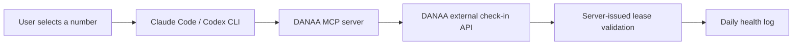

# Privacy Data Flow

```mermaid
flowchart LR
  U["User selects a number"] --> C["Claude Code / Codex CLI"]
  C --> M["DANAA MCP server"]
  M --> A["DANAA external check-in API"]
  A --> L["Server-issued lease validation"]
  L --> D["Daily health log"]
```

The plugin does not send code or chat transcripts. It sends only the explicit answer payload.
